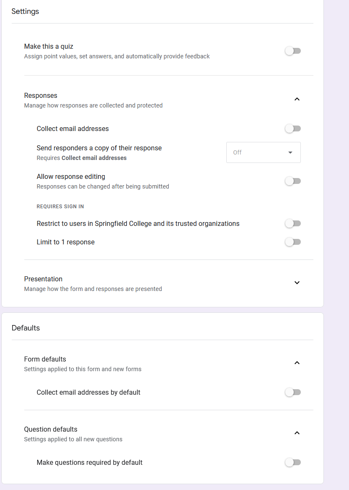

# NoBackendForms

Example URL when copied from Google Forms prefilled link:

`https://docs.google.com/forms/d/e/1FAIpQLSdy3I65AZ0NO63YsL8kw9WQM4zHBXM3SVWsBzFBYmdNNpEI1A/viewform?usp=pp_url&entry.1962322928=FAKE_EMAIL&entry.1241410645=FAKE_SUBJECT&entry.515916046=FAKE_NOTE`

Note the following 'fields` that have been created:

- `entry.1962322928` - email field
- `entry.1241410645` - subject field
- `entry.515916046` - note field

Google forms sees `entry.1962322928` as being the email field. Therefore when we construct the URL we will use to POST the data, we must use these fields. For example the following URL is needed to SUBMIT a form.

`https://docs.google.com/forms/u/1/d/e/1FAIpQLSdy3I65AZ0NO63YsL8kw9WQM4zHBXM3SVWsBzFBYmdNNpEI1A/formResponse`

