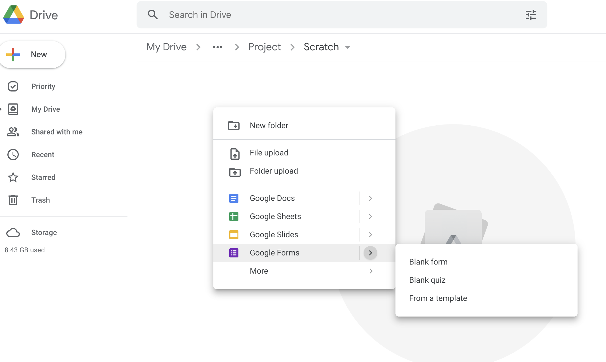
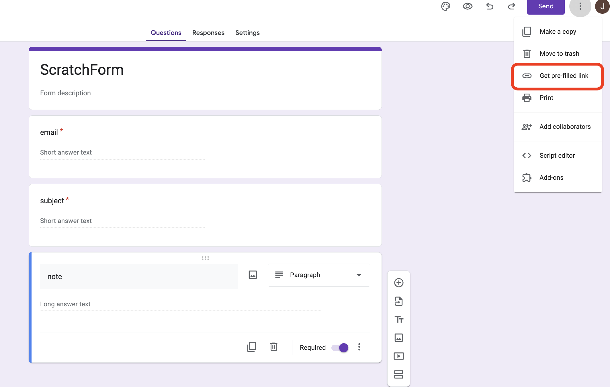
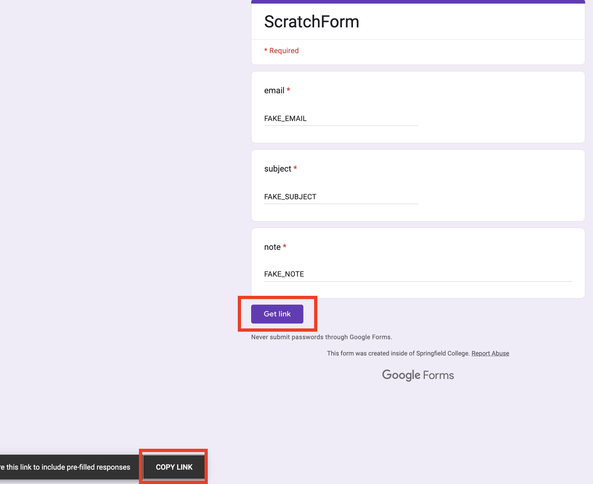

# NoBackendForms

This repository demonstrates how to create a form that can "save data" online without needing a backend server and database. The whole idea relies upon using [Google Forms](https://www.google.com/forms/about/) and an accompanying Google Sheet to save your data. Basically, you are using Google Drive and all as your backend!

## Create Form

First make sure you have a google account. Then open up Google Drive and create a new form and save it somewhere:



Click the form settings and make sure to modify your form settings so that it is open to all people and they don't have to be authenticated:


Create a form like below and then click the top right button (3 vertical dots) and click the item "get prefilled link"



A new page will pop up where you can fillout the form. Click the "Get Link" button. A gray popup will appear. Click the copy link. Here is an example:



Example URL when copied from Google Forms prefilled link:

`https://docs.google.com/forms/d/e/1FAIpQLSdy3I65AZ0NO63YsL8kw9WQM4zHBXM3SVWsBzFBYmdNNpEI1A/viewform?usp=pp_url&entry.1962322928=FAKE_EMAIL&entry.1241410645=FAKE_SUBJECT&entry.515916046=FAKE_NOTE`

Note the following 'fields` that are in the URL:

- `entry.1962322928` - email field
- `entry.1241410645` - subject field
- `entry.515916046` - note field

Google forms sees `entry.1962322928` as being the email field. Therefore _when_ we construct the URL we will use to POST the data, we must use these fields. We should use this modified `base url` during our HTTP request (note that it is slightly modified from above, extra `/u/1` and instead of `viewForm` we do `formResponse`)

`https://docs.google.com/forms/u/1/d/e/1FAIpQLSdy3I65AZ0NO63YsL8kw9WQM4zHBXM3SVWsBzFBYmdNNpEI1A/formResponse`.

## Write JavaScript HTTP Request

You can see the javascript that I used to create the HTTP request inside `index.html`, Lines 9-47. I will put it again here:

```javascript
const FORM_URL =
  "https://docs.google.com/forms/u/1/d/e/1FAIpQLSdy3I65AZ0NO63YsL8kw9WQM4zHBXM3SVWsBzFBYmdNNpEI1A/formResponse"; // google form URL
const EMAIL_FORM_ID = "entry.1962322928"; // the google form entry field for email
const SUBJECT_FORM_ID = "entry.1241410645"; // the google form entry field for subject
const NOTE_FORM_ID = "entry.515916046"; // the google form entry field for note
function submitForm(formData) {
  console.log(
    `Received - email: ${formData.email}; subject: ${formData.subject}; note: ${formData.note}`
  );
  console.log("Preparing to submit data to the Google Form");

  // collecting all data into an object
  const formDetails = {};
  formDetails[EMAIL_FORM_ID] = formData.email;
  formDetails[SUBJECT_FORM_ID] = formData.subject;
  formDetails[NOTE_FORM_ID] = formData.note;
  // convert the javascript formDetails object to URL string for POST request
  const formBodyString = new URLSearchParams(formDetails).toString();
  // uncomment to see the url encoded string
  console.log(formBodyString);

  // posting data to our google form
  fetch(FORM_URL, {
    method: "POST",
    headers: {
      "Content-Type": "application/x-www-form-urlencoded;charset=UTF-8",
    },
    mode: "no-cors",
    body: formBodyString,
  }).then(() => {
    console.log("Success!");
    // show message
    formData.showMessage = true;
    formData.email = "";
    formData.subject = "";
    formData.note = "";
    // remove message in 2 seconds
    setTimeout(() => (formData.showMessage = false), 2000);
  });
}
```
